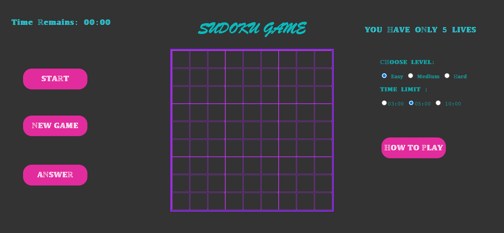

# 🔢 Sudoku Game  
A clean and interactive Sudoku game built using **HTML, CSS, and JavaScript**.  
The game includes difficulty selection, time limits, a 5-life system, and an attractive UI.

---

## 🖼️ Interface Preview

  

---

## ⭐ Features

-  **Interactive Sudoku Board**
-  **Auto Sudoku Generator**
-  **Fast Backtracking Solver**
-  **Three Difficulty Levels** (Easy, Medium, Hard)
-  **Multiple Time Limits** (3 min, 5 min, 10 min)
-  **Life System (5 Attempts)**
-  **New Game / Restart Options**
-  **Show Solution (Answer Button)**
-  **Responsive Layout**

---

## 🛠️ Technologies Used

- **HTML** for structure  
- **CSS** for styling  
- **JavaScript** for game logic  
- **Backtracking Algorithm** for solving puzzles  
